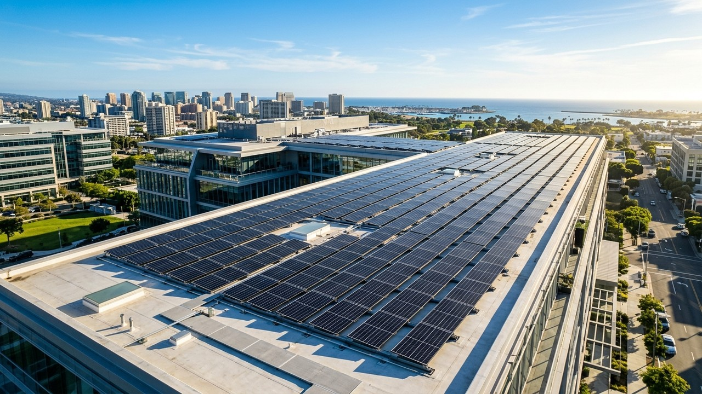

# Vidya Vahini Solar Agency (A Unit of Risaenergy Pvt Ltd)

> **Authorized Solar EPC & PM Surya Ghar Subsidy Empaneled Partner**  
> Serving Prayagraj, Meja, Koraon, Shankargarh & Eastern Uttar Pradesh.

## ⚡ Overview

**Vidya Vahini Solar Agency** (CIN: `U35105UP2024PTC202353`, GSTIN: `09GLQPS9587D2ZX`) is a regional leader in rooftop solar installations, agro-industrial Solar Atta Chakkis (Flour Mills), agricultural solar tubewells, and commercial solar EPC plants. With **10+ years of local execution heritage** and **80+ commissioned projects**, this platform delivers a modern, high-converting digital presence for residential, agricultural, and industrial solar clients.

---

## 🌟 Key Platform Features

1. **Strictly Static Clean-Tech Architecture**: Built with pure semantic HTML5, modern Tailwind CSS, Lucide Icons, and vanilla JavaScript.
2. **Interactive Solar Savings & PM Surya Ghar Subsidy Calculator**: Real-time UPPCL tariff sizing engine calculating monthly units, system capacity (kW), Central MNRE subsidy (up to ₹78,000), UP State DBT top-up (up to ₹30,000), net investment, and 25-year financial savings.
3. **Instant WhatsApp Dossier Dispatch**: Direct one-click export of custom solar proposals pre-formatted into official WhatsApp chat (Zero PDF overheads).
4. **15 Bespoke Homepage Sections**:
   - Micro Top Bar & Sticky Glassmorphism Header
   - Hero Section with PM Surya Ghar Empaneled Badge
   - Luminous Continuous Metric Ribbon (Animated roll-up counters)
   - Why Choose Us (Engineering Radar Grid)
   - 6 Core Solar Solutions (Residential, Atta Chakki, Agricultural Pump, Commercial, Hybrid BESS, On-Grid Net Metering)
   - 4-Step Engineering Conduit Pipeline
   - Dynamic PM Surya Ghar Subsidy Calculator
   - Filterable Project Showcase (80+ Commissioned Sites)
   - Authorized Brand Partners (Loom Solar TopCon, UTL, Microtek, Growatt, Tata Power Solar)
   - Step-Ladder Government Subsidy Breakdown
   - Verified Customer Case Studies & Authentic Portraits
   - Frequently Asked Questions Accordion
   - Dual-Location Geographic Feasibility (Naini HQ & Koraon Branch)
   - Free Site Survey & Sizing Lead Capture Form
   - Comprehensive Legal & Corporate Footer
5. **Multi-Page Sub-Structure**:
   - `index.html`: Complete high-ticket showcase
   - `services.html`: Technical specification breakdowns & pricing metrics
   - `projects.html`: Filterable project portfolio & video showcase
   - `about.html`: Corporate governance, MCA compliance & technical standards
   - `contact.html`: Dual-office location maps & feasibility inquiry
   - `blogs.html`: Knowledge Hub linking to all 7 dedicated technical & financial guides:
     - `blog-pm-surya-ghar.html`: PM Surya Ghar ₹1,08,000 Subsidy in Prayagraj
     - `blog-solar-atta-chakki.html`: 15HP Solar Atta Chakki Economics & Diesel Elimination
     - `blog-topcon-vs-mono-perc.html`: TopCon vs Mono PERC in 46°C UP Summer Heat
     - `blog-net-metering-uppcl.html`: 5-Stage UPPCL / PuVVNL Net-Metering Approvals
     - `blog-solar-water-pumps.html`: 3HP–7.5HP Submersible Pumping in Vindhyan Soil
     - `blog-on-grid-vs-hybrid.html`: On-Grid vs Off-Grid vs Hybrid Battery Architectures
     - `blog-solar-maintenance.html`: Soiling Loss, Dust Impact & Plant O&M Protocols
6. **Hardware-Accelerated Clean-Tech Animations**:
   - IntersectionObserver scroll reveals (`reveal-init`, `reveal-left`, `reveal-scale`)
   - Animated counter roll-ups on regional trust metrics
   - Subtle solar amber & emerald pulse glows
   - Smooth slide-out mobile drawer with high-priority stacking contexts (`z-index: 99999`)
   - Interactive calculator value pop animations

---

## 🛠️ Technology Stack

- **Markup**: Semantic HTML5 with accessibility metadata
- **Styling**: Tailwind CSS CDN + Custom Hardware-Accelerated CSS (`css/styles.css`)
- **Icons**: Lucide Icons
- **Scripting**: Vanilla JavaScript (ES6+ modular logic)
- **Zero Heavy Bundlers / Zero Node Dependencies**: Loads instantly on 3G/4G/5G mobile connections.

---

## 📍 Headquarters & Field Hubs

- **Headquarters**: 10/C 4A Madhavpur Patti, Kharakauni, Naini, Prayagraj, UP – 211008
- **Rural Field Hub**: 169 Baidwar Kala, Koraon, Prayagraj, UP – 212306
- **Direct Engineer Inquiries**: +91 94505 09659 / +91 89530 11508
- **Official Email**: vidyavahinisolaragency@gmail.com
